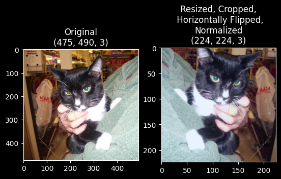
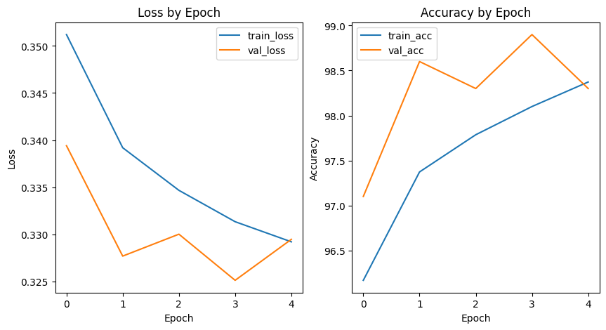

# Cat-Dog Classification

## Inference

See this [Jupyter Notebook](./training/inference.ipynb) for more.

## Training

How to train from scratch:

1. Download the dataset from [Microsoft Download Center](https://www.microsoft.com/en-us/download/details.aspx?id=54765) (select English).
2. Extract and put the dataset folder under `data/`. If success, there should be two folders, `data/PetImages/Cat/` for cat images and `data/PetImages/Dog/` for dog images.
3. Create and activate a virtual environment that uses Python 3.12.
4. Install PyTorch 2.5.1 (see [this instruction](https://pytorch.org/get-started/previous-versions/)).
5. Install other dependencies with these versions: PIL 10.3.0, numpy 2.0.1, polars 1.21.0.
6. Run the [Jupyter Notebook](./training/training.ipynb) that trains the model on the training set and validates on the validation set.
7. Run the [Jupyter Notebook](./training/evaluation.ipynb) that evaluates the model on the testing set.

Images need to be preprocessed before fed to the model (see the image below). See the transform functions in [this notebook](./training/training.ipynb).

This is the plot of the losses and accuracy scores by epoch on the training and validation sets (see the image below).

